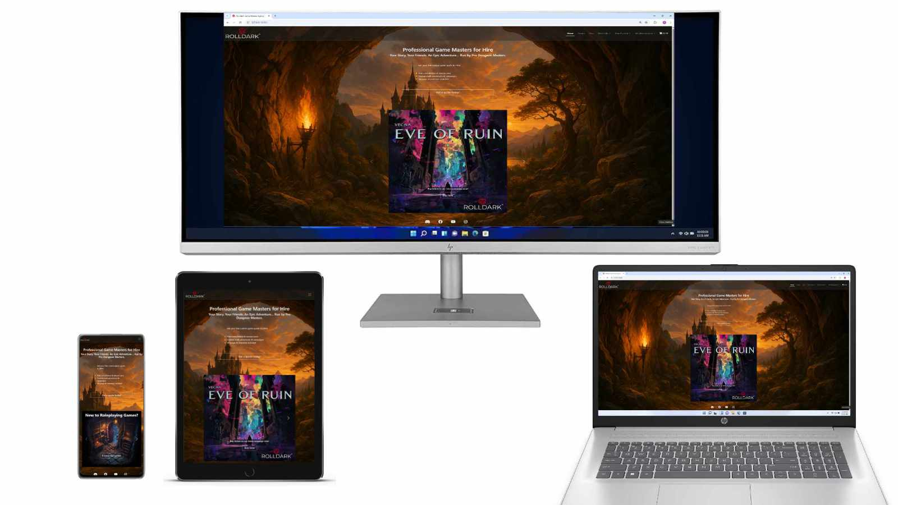
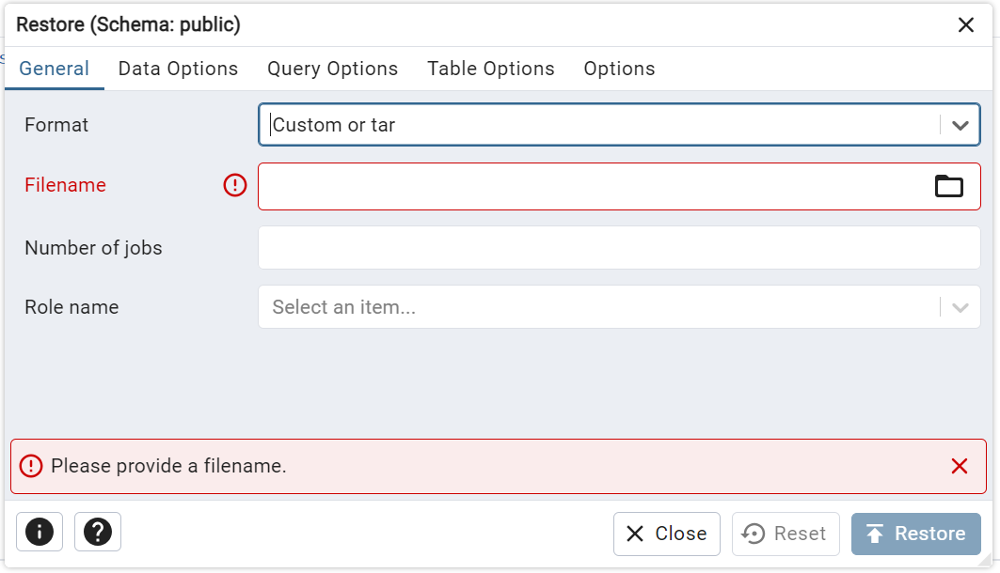

# Rolldark Game Master Agency

Rolldark Game Master Agency are a UK based company who provide paid Game Masters for Table Top Roleplaying Games both online and in person, as well as provide supplimentary products like Dice and Dungeons and Dragons modules for customers to run themselves.

The business currently uses a variety of third party solutions to run its website, which they have shown an interest in consolodating into one solution. They have mentioned several challenges they currently face. By creating a website with a robust database, we can consolodate many of those solutions into one place with a great deal of scope for future expansion.

[The deployed version of the site is available here](https://rolldark-b52dc36be8e7.herokuapp.com/)

## Contents

* [User Experience](#user-experience)
    - [User Stories](#user-stories)
* [Design](#design)
    - [Color Scheme](#color-scheme)
    - [Typography](#typography)
    - [Imagery](#imagery)
    - [Wireframe](#wireframe)
    - [Database](#database)
* [Features](#features)
* [Accessibility](#accessibility)
* [Technologies Used](#technologies-used)
    - [Languages Used](#languages-used)
    - [Frameworks, Libraries & Programs Used](#frameworks-libraries--programs-used)
* [Deployment and Local Development](#deployment-and-local-development)
    - [Deployment](#deployment)
    - [Local Development](#local-development)
* [Testing](#testing)
    - [Solved Bugs](#solved-bugs)
    - [Known Bugs](#known-bugs)
* [Credits](#credits)
    - [Code Used](#code-used)
    - [Media](#media)
    - [Acknowledgements](#acknowledgements)

## User Experience

### User Stories

---
|**End User Stories**| |
|---|---|
| **All Users** | I want the site to be responsive to my device |
| | I want the site to be easy to navigate |
| | I want to be able to check out quickly and easily if I make a purchase |
| | I want to be able to sort products according to my needs |
| **First Time User** | I want to quickly understand the services Rolldark Game Master Agency offer |
| | I want the user registration process to be quick and easy |
| **Returning User** | I want to be able to quickly navigate to the relevant part of the site for my needs |
| | I want the option to stay logged in for faster checkout |

---
| **Admin User Stories** | |
|---|---|
| **Purchases** | I want the site to automatically respond to customers, confirming purchases |
| | I want customers to be able to see previous purchases, allowing them to easily purchase the same items again |
| | I want customers to be able to contact us directly through the site, without the need to refer them to a 3rd party API |
| **Site Management** | I want to be able to add products to the site easily |
| | I want to be able to edit and delete products through the main site, not the admin panel |
| | I want to be able to select if a product is "Live" or not, allowing me to temporarily remove or edit products without deleting them from the database |
| | I want to edit the advertising on my homepage, informing customers of new products without the need for a webmaster |
| | I want to be able to create, edit and delete Game Master profiles, to keep the team info up to date easily |

## Design

### Color Scheme

Because of the nature of the site, I went with a bold, colourful palette for the project. I wanted customers to be intrigued and excited about the products on offer, and this seemed like the best way to achieve this.

### Typography

Because of the wide range of customers likely to visit the site, as well as the amount of images already vying for the customer's attention; I wanted to keep the fonts simple and easy to read to ensure they were not distracting to the user.

I decided to keep the Bootstrap default font family which uses Helvetica and Arial. Both are sans-serif fonts, making them clear and easy to read.

### Imagery

Because of the high-fantasy nature of the games on sale, it makes sense for the imagery on the site to use lots of bold, colourful images that elicit a sense of excitement in the customer. In addition to the product images, the main images on display are on the Home page and the About page.

*Home Page*

*About Page*

### Wireframe

Wireframes were created using Affinity Designer

**Home Page**

**About Page**

**Games / Dice Page**

**Product Detail Page**

**Cart Page**

### Database

My database provides relations between Categories, Products and Orders to populate the final order details. I also included two non-relational models to allow the dynamic creation of site content for the Call to Action and Game Master portions of the website. This will greatly simplify site management in the future, allowing non technical users to make decisions about the site's layout without the need for a webmaster.

## Features

**Homepage**

The site has a colorful landing page, with a strong call to action at the top inviting customers to contact the company for a quote. The 'Get a Quote Today' button redirects to the Contact Us page

The home page also has a Call To Action Carousel, a rotating pane of images advertising the latest products on offer. These are dynamically created from the database, allowing Admin users to alter what products are advertised without the need for a Webmaster.

**Games / Dice**

The Games page filters products to only display Games to the customer. This was the most intuitive way to display this information to the customer, as the site only offers two main categories of product - Games and Dice.

The Dice page filters products to only display Dice.

Products are displayed on cards to give a preview for the products on sale. If the user is logged in as a Superuser, additional buttons show up at the bottom of the card allowing the superuser to Edit or Delete products.

As an additional security measure, a Modal pops up if the superuser selects Delete Product to ensure that they want to remove this product from the database:

**Product Detail**

The product detail page displays information about the product the customer has selected, and allows options to add products to the cart.

If the product has a "Game Dates" property, a dropdown box allows the user to select which date they would like to purchase a ticket for:

When the user updates the quantity purchased, the price automatically updates to show the user the subtotal:

If the product has a delivery charge attached, the price will display a subtotal along with the delivery cost to make it as clear as possible how much the customer will be charged:

**About Us**

The About Us page contains some information about Rolldark Game Master Agency, as well as a scrolling carousel of images to show off the types of experiences available from the company.

Further down the page is information about the Game Masters currently working for Rolldark. Aside from the large image of Robert Bradley (Founder and owner of Rolldark) all the Game Master profiles are dynamically created from the database, allowing any admin user to update these details without the need for a Webmaster.

The 'More Info' button on each card brings up a modal with an enlarged image and bio of the selected Game Master.

If the user is logged in as a superuser additional buttons show at the bottom of the card allowing them to Edit or Delete the Game Master details:

As with products, if you click Delete a modal pops up to check you want to delete this Game Master:

**Contact Us**

The Contact Us page is a simple form inviting the customer to send Rolldark a message.

Once the form is submitted successfully it redirects the user to display a message, and invites them to browse Rolldark's games whilst waiting for a response.

**Your Account**

If the user is logged in the 'Your Account' menu shows, allowing them to alter their profile or log out

**My Profile**

The profile page has a simple form to allow users to update their delivery info for quicker check out. It also has a history of all orders placed, allowing them to see previous order information.

**Log Out**

The site keeps users logged in by default to make checkout quicker and easier, but should the user need to log out they can do so in the 'Your Account' tab by selecting Log Out

**Site Management**

If the user is logged in as a Superuser the 'Site Management' menu shows, allowing them to alter details on the website.

**Inactive Products**

This page displays inactive products that are saved in the database. This allows Admin users to temporarily disable products (if they are out of stock, for example), or create products in advance of them going on sale.

These products can be edited and deleted in exactly the same way as live products elsewhere on the site.

**Add new product**

This allows Superusers to add products to the store with a simple form.

I have included tool tips for the process to make it as simple to navigate as possible. I have also included a system for dynamically creating Game Dates for the JSON field on the database. All the user has to do is select how many game dates they wish the product to have and they can add ticket options to the product without having to edit a complicated JSON object:

**Edit Product**

The Edit Product page allows Superusers to alter existing product details. The form dynamically populates with the data from the database, using the same form as the one to create a new product:

**Add Call to Action**

This allows Superusers to add advertisements to the Call to Action carousel on the homepage, simplifying site management.

Note that the form has a toggle for Dark Text, ensuring that text elements and buttons remain visible on Carousel Images with a light background!

**View All Actions**

The View All Actions page allows the user to view all currently active Call To Action items. These can be edited or deleted in the same way as products are elsewhere on the site

**Add Game Master**

The Add Game Master page allows the user to add a new game master to the About Us page

**Cart**

The Cart page shows an order summary, allowing the user to review their purchases before proceeding to the checkout

Users can update or remove items from their cart here. Much like the rest of the site, if the user tries to delete an item a Modal pops up confirming this:

## Accessibility

## Technologies Used

### Languages Used

### Frameworks, Libraries & Programs Used

## Deployment and Local Development

### Deployment

The site is deployed using Heroku - [The deployed version of the site is available here](https://scrummaester-81eb70fbef06.herokuapp.com/)

**Heroku app setup**

1. From the [Heroku Dashboard](https://dashboard.heroku.com/), click the new button in the top right corner and select create new app.
2. Give your app a name (this must be unique), select the region that is closest to you and then click the create app button bottom left.

**Create the Database**

1. From the [Heroku Dashboard](https://dashboard.heroku.com/), click the name of the web app created in the previous step.
2. Click on the "Resources" tab, then click on the "Find more add-ons" button

3. Scroll through the list of add-ons until you find "Heroku Postgres".

 

4. By clicking on the "Heroku Postgres" add-on, the following page is displayed. Click on the "Install Heroku Postgres" button

5. The next page allows you to select which app to associate the database with. Select the payment plan you wish to use for this app, then click inside the "App to provision to" text box to bring up the drop-down list of apps. Select the app you wish to add the database to.

6. Press the "Submit Order Form" button to connect the database to your app.

7. Return to the app page, where you will see "Heroku Postgres" has been added to your app. Click "Heroku Postgres" to open the database and get the Database Connection Parameters.

8. Click the "Settings" tab

9. Then click "View Credentials"

10. Make note of these credentials, as you will need them to connect to your database.

11. Open pgAdmin

12. Right click "Servers" in the top left corner, then "Register" / "Server"

13. Name your server

14. Click the "connection" tab, entering the details from step 10. Then click "save"

**Restoring the database from backup file**

If you haven't already, download the scrummaester.backup file from the GitHub repo - [BenMilesRocks/3-scrummaester](https://github.com/BenMilesRocks/3-scrummaester).

1. In pgAdmin, navigate to the Heroku database.

2. Open the "Schemas" tab.

3. If a Schema does not currently exist, right click to create a Schema where the data will reside.

4. Right click the Scheme, and select "Restore"

5. Click the folder in the "Filename" section to navigate to the directory where you saved the backup file

6. Click "restore". This should create the tables and populate them with data.

*Please note* The default login for the Super User is Username: user1 , Password: password. This should be changed as soon as possible to prevent security issues.

### Local Development

**How to fork**

To fork the repository:

1. Log in (or sign up) to Github.
2. Go to the repository for this project, [BenMilesRocks/3-scrummaester](https://github.com/BenMilesRocks/3-scrummaester).
3. Click the Fork button in the top right corner.

**How to clone**

To clone the repository:

1. Log in (or sign up) to GitHub.
2. Go to the repository for this project, [BenMilesRocks/3-scrummaester](https://github.com/BenMilesRocks/3-scrummaester).
3. Click on the code button, select whether you would like to clone with HTTPS, SSH or GitHub CLI and copy the link shown.
4. Open the terminal in your code editor and change the current working directory to the location you want to use for the cloned directory.
5. Type 'git clone' into the terminal and then paste the link you copied in step 3. Press enter.
6. Install the packages from the requirements.txt file by running the following command in the terminal:

##
        pip3 install -r requirements.txt

## Testing

Please refer to [testing.md](static/assets/documentation/testing/testing.md) for all testing carried out.

### Solved Bugs

| **No.** | **Bug** | **How I Solved The Issue** |
|:-------:|:-------:|:--------------------------:|
| 1 | Navbar does not correctly highlight currently open page | Used a conditional statement to check if the URL matches the open page, and applying the Bootstrap 'active' class if it does |
| 2 | TextField data from database does not display text formatting, making product descriptions difficult to read | Used the Django 'linebreaks' filter which preserves paragraphs, making the data easier to read |
| 3 | Game Master cards on the About page do not conform to the same height, making the layout messy | Added responsive height properties in CSS to ensure all the images conform to the same style |
| 3 | Add Product requires the user to understand JSON formatting, which would make it difficult for users to add Games to the database | I implemented code to dynamically create Date field inputs, and then a JavaScript function to input this data into the Game Dates field on behalf of the user |
| 4 | After checkout, Delivery Costs are sometimes incorrectly applied to products | Modified the update_total function to set delivery charge to 0 for each line item, ensuring delivery cost is calculated correctly |
| 5 | Product Detail page does not correctly calculate price for Dice products | Split the JavaScript function to display the total price into two functions - one for dice, one for games - to allow seperate handling for different products |

### Known Bugs

Most of the known bugs I have seen relate to the Add Product page. Although this would need addressing in a future version of the site, it seemed less important than the customer-facing issues on the site. The issue with Order Emails not sending occurred only during testing a couple days prior to the project being submitted.

| **No.** | **Bug** |
|:-------:|:-------:|
| 1 | Edit Product does not dynamically create date fields in the same way Add Product does |
| 2 | If adding a Game in Add Product and the form is invalid, it will remove the dynamically created Game Dates |
| 3 | Dynamically created Date fields do not match the styling of the rest of the page |
| 4 | Order Confirmation Emails are not sending on the deployed version of the site |

## Credits

### Code Used

I used code from [This Learn Django Article](https://learndjango.com/tutorials/django-email-contact-form-tutorial) to create the Contact form.

The Call to Action carousel on the Home page took its structure from an article on [Free Frontend.dev](https://freefrontend.dev/code/bootstrap/call-to-action/call-to-action-carousel/), before I added the dynamic elements from the database.

[This Stack Overflow Post](https://stackoverflow.com/questions/14853779/dynamically-creating-a-specific-number-of-input-form-elements) provided the code for dynamically creating Input Elements for the Add Product page.

For the Toasts, I took code from [CSS Tricks.com](https://css-tricks.com/snippets/css/css-triangle/) to add the triangle at the top of the Toast.

[This Stack Overflow Post](https://stackoverflow.com/questions/75371409/how-to-render-an-arbitrary-set-of-key-value-pairs-from-a-jsonfield-in-a-jinja2) provided code I used to display data from the JSONfield in my database, allowing the user to select from an array of Game Dates on the Product Detail page.

Finally, [This Stack Overflow Post](https://stackoverflow.com/questions/25044370/make-clicked-tab-active-in-bootstrap) explained how to dynamically change the Active class for items on the navbar.

### Media

All images were taken from [The Current Rolldark Website](https://rolldark.co.uk/) and their [Instagram Page](https://www.instagram.com/RolldarkGMA).

### Acknowledgements
